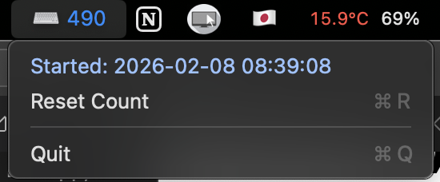

# ⌨️KeystrokeCounter (Menu Bar App)

A simple macOS menu bar app that shows the total number of key presses in real time.


## Build

```bash
./build.sh
```

## Run
### for debug
```bash
./.build/KeystrokeCounter
```
### run app locally
1. prepare a certificate
    1.1 open Keychain Access
    1.2 create a new certificate (Certificate Assistant → Create a Certificate...)
    1.3 set `Identity Type` to `Self Signed Root`
    1.4 set `Certificate Type` to `Code Signing`
    1.5 name it e.g. "KeystrokeCounter Dev"
    1.6 after creation, double click the certificate in Keychain Access
    1.7 expand `Trust` section and set `Code Signing` to `Always Trust` (or set `When using this certificate` to `Always Trust`)
2. sign the app
    ```bash
    codesign --force --deep --sign "<cert name>" /path/to/KeystrokeCounter.app
    ```
1. open the app
    double click the app in Finder

## Permissions

macOS will prompt for Accessibility permission on first launch. Enable it in:
System Settings → Privacy & Security → Accessibility.

If permission is denied, the app will show an alert with a shortcut to the Settings page.

## Notes

- Counts key down events only.
- Uses a session event tap; it won’t log or store key contents, only counts.
